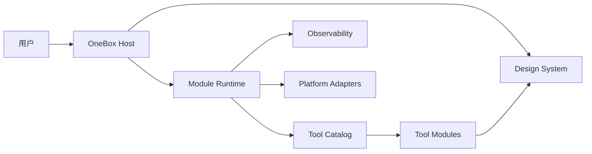

# 架构

OneBox 对内置可信工具采用模块化单体、静态注册和按需激活。该决定已经记录在 [ADR-0001](decisions/0001-use-static-module-registration.md)。模块默认运行在同一应用进程中，因此当前提供的是状态、数据、依赖和生命周期隔离，不是安全沙箱或进程崩溃隔离。

## 技术栈

- 平台：macOS。
- 产品代码：Swift。
- UI 与应用生命周期：SwiftUI。
- 窗口控制、辅助功能及 SwiftUI 未覆盖的系统能力：从 Swift 调用 AppKit。
- 基础系统能力：Foundation。
- 构建与依赖：Xcode 和 Swift Package Manager。

不引入 TypeScript、JavaScript、Rust 或第二套应用运行时。新功能默认使用简单 SwiftUI MV；只有真实状态复杂度证明需要时才增加 MVVM、MVI、TCA 等架构层。



图中名称表示逻辑职责，不要求现在就拆成独立 Swift package。物理目录和接缝由第一个可运行竖切的真实依赖决定。

## 职责

| 模块 | 拥有 |
| --- | --- |
| Host | 应用生命周期、窗口、导航、组合根、权限提示和统一错误呈现 |
| Module Runtime | 注册、列举、激活、停用、任务回收和日志上下文 |
| Tool Module | 单个工具的业务、内容 UI、状态和数据 |
| Design System | 视觉 token、布局原语和标准加载/空白/错误状态 |
| Observability | 结构化日志、脱敏和写入 |
| Platform Adapter | 辅助功能、窗口、音频、通知、网络和存储等具体系统能力 |

## 依赖规则

```text
host -> concrete tool modules
host -> module runtime
tool module -> host-provided interfaces
tool module -> design system
platform adapter -> host-provided interfaces
```

- 工具模块不得导入另一个工具模块或宿主实现。
- 宿主组合根是唯一了解具体工具实现的地方。
- 工具只能获得构造时注入的依赖，不访问全局依赖容器。
- 共享模块只有在第二个真实消费者出现后才提取。

## 隔离保证

- 每个工具拥有独立状态根和存储命名空间。
- Module Runtime 持有工具生命周期，停用时回收其定时器、订阅和可取消任务。
- 模块错误在接缝处转换，由宿主显示标准错误状态。
- 操作系统权限由注入的 Platform Adapter 请求和使用。
- 进程隔离只有在真实阻塞、崩溃、不受信任代码或不同运行时需求出现后才重新决策。
