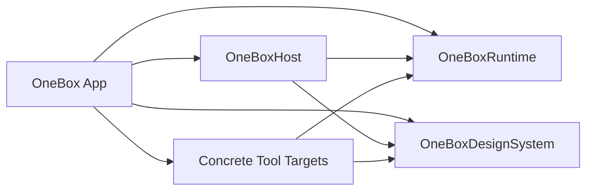

# 架构

OneBox 对内置可信工具采用模块化单体和静态注册。该决定记录在
[ADR-0001](decisions/0001-use-static-module-registration.md)。所有 target 最终静态链接到同一个
macOS 应用，因此 target 边界提供编译期依赖隔离，不提供安全沙箱、进程崩溃隔离或恶意代码防护。

## 当前实现

| 能力 | 当前状态 |
| --- | --- |
| 宿主 | 已实现窗口、侧边栏、工具切换和统一占位内容 |
| 注册 | 已实现类型安全的 `ToolRegistration`、唯一 ID 检查和组合根静态注册 |
| 模块边界 | 已通过独立 Xcode target 强制，见 [ADR-0003](decisions/0003-enforce-module-dependencies-with-targets.md) |
| Design System | 已实现宿主当前使用的颜色、字体、间距和占位状态 |
| AppKit 桥接 | 窗口比例与最小尺寸配置属于应用窗口实现，直接位于 App target |
| 工具业务 | 股票看盘、博客收听和窗口聚焦均未接入业务，只显示“待接入” |
| 激活与生命周期 | 当前只有选中后构造的 `onOpen` 语义；尚无随应用启动的调度、显式停用或任务回收器 |
| 数据、权限与日志 | 尚无业务存储、权限请求或运行时日志实现 |

这张表是当前实现的可读快照，事实仍以代码、测试和 `project.yml` 为准。后文中的模块契约描述新增真实业务时必须满足的边界，不表示对应能力已经落地；实现变化必须在同一变更中更新本表。

## 技术栈

- 平台：macOS。
- 产品代码：Swift。
- UI 与应用生命周期：SwiftUI。
- 窗口控制、辅助功能及 SwiftUI 未覆盖的系统能力：从 Swift 调用 AppKit。
- 基础系统能力：Foundation。
- 构建与依赖：Xcode 和 Swift Package Manager。

不引入 TypeScript、JavaScript、Rust 或第二套应用运行时。新功能默认使用简单 SwiftUI MV；只有真实状态复杂度证明需要时才增加 MVVM、MVI、TCA 等架构层。

## 当前编译依赖

下图只表达 `project.yml` 中由编译器执行的 target 依赖，不表达用户操作流或未来运行时调度：



`OneBoxRuntime` 和 `OneBoxDesignSystem` 当前没有项目内依赖。Observability 尚未产生真实代码，因此不出现在依赖图中。

## 当前职责

| 模块 | 当前拥有 |
| --- | --- |
| App | 应用生命周期、窗口创建、窗口级 AppKit 桥接、组合根和具体工具注册 |
| Host | 侧边栏、导航、工具标题和内容区域 |
| Runtime | 工具身份、注册值和注册目录 |
| Tool | 单个工具的内容入口；当前均为占位内容 |
| Design System | [设计规范](design.md)定义的视觉 token、排版、几何和占位状态 |

权限提示、统一错误呈现、业务状态、数据、任务回收和结构化日志在真实需求出现前不预建空层。

## 依赖规则

```text
app -> host, runtime, design system, concrete tool modules
host -> runtime, design system
tool module -> runtime, design system
runtime, design system -> no project target
```

- 工具模块不得导入另一个工具模块、`OneBoxHost` 或应用 target。
- `OneBox/App/AppComposition.swift` 是唯一导入并注册全部具体工具的组合根。
- 无依赖工具可以公开静态注册值；出现真实依赖后，由应用组合根调用工具的窄 factory 注入，工具不访问全局依赖容器。
- 工具需要平台能力时，由应用组合根通过窄接口注入；工具不得直接查找宿主。
- 共享代码只有在第二个真实消费者出现后才提取。
- 新增依赖必须先满足上述方向，再写入 `project.yml`；不得通过把源码加入多个 target 绕过依赖规则。

## 物理结构

| Target | 源目录 | 允许的项目内依赖 |
| --- | --- | --- |
| `OneBox` | `OneBox/App` | Host、Runtime、DesignSystem 和全部具体工具 |
| `OneBoxHost` | `OneBox/Host` | Runtime、DesignSystem |
| `OneBoxRuntime` | `OneBox/Runtime` | 无 |
| `OneBoxDesignSystem` | `OneBox/DesignSystem` | 无 |
| `*Tool` | `OneBox/Tools/<Tool>` | Runtime、DesignSystem |

## 已接受但未实现的业务契约

第一条真实工具竖切引入相应能力时，必须同时满足并验证：

- `onOpen` 工具只在用户打开时产生业务 I/O；首个需要随应用启动的工具落地时，必须同时引入激活类型、宿主调度和测试。
- 同一工具重复打开不得重复注册全局监听器；关闭后必须停止它拥有的任务、定时器和订阅。
- 每个工具拥有独立业务状态和存储命名空间，宿主不解析工具数据。
- 模块错误在接缝处转换为可分类结果，由宿主呈现可行动状态。
- 操作系统权限通过注入的平台接口请求和使用。
- 第一个真实运行时日志调用出现时，再按[日志规范](logging.md)建立统一入口。

这些条目是验收条件，不是当前 Runtime 已经提供的机制。进程隔离只有在真实阻塞、崩溃、不受信任代码或不同运行时需求出现后才重新决策。
